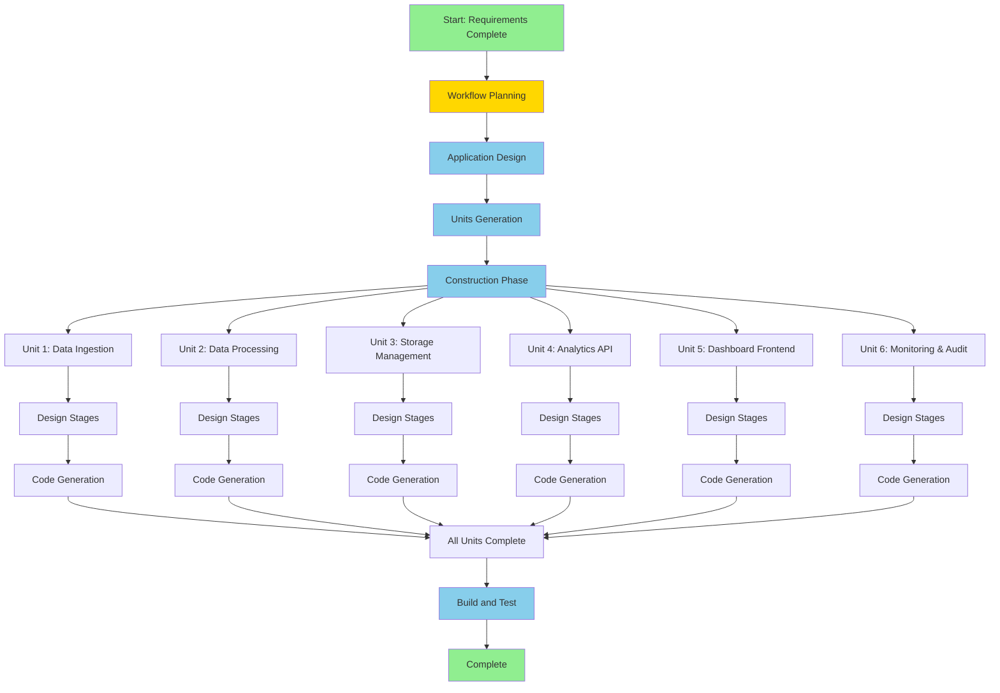

# Workflow Execution Plan
## Data Integration and Analytics Platform

**Version**: 1.0  
**Date**: 2026-03-04  
**Project Complexity**: High - Enterprise Multi-Component System

---

## 1. Workflow Overview

This plan outlines the adaptive workflow for building the data integration and analytics platform. Given the complexity and scope, we'll execute a comprehensive workflow with all relevant stages.

---

## 2. Phase Execution Strategy

### INCEPTION PHASE ✅
**Status**: Partially Complete

- [x] Workspace Detection - Complete
- [x] Requirements Analysis - Complete
- [ ] Workflow Planning - In Progress
- [ ] Application Design - To Execute
- [ ] Units Generation - To Execute

**Rationale**: Full inception phase needed due to:
- Complex multi-component architecture
- Multiple integration points
- Enterprise-grade requirements
- Need for clear component boundaries

---

### CONSTRUCTION PHASE 🔄
**Status**: Pending

**Per-Unit Execution**: Each unit will go through applicable stages before moving to next unit

**Stages per Unit**:
- Functional Design (if new data models/business logic)
- NFR Requirements (performance, security considerations)
- NFR Design (pattern implementation)
- Infrastructure Design (deployment architecture)
- Code Generation (always executed)

**Rationale**: Comprehensive construction needed due to:
- Multiple technology integrations
- Performance and scalability requirements
- Security and compliance needs
- Complex data transformations

---

### OPERATIONS PHASE 🔄
**Status**: Pending

- Build and Test - To Execute

**Rationale**: Critical for:
- Integration testing across components
- Performance validation
- End-to-end workflow verification

---

## 3. Application Design Decision

**Decision**: ✅ EXECUTE Application Design

**Justification**:
- New microservices architecture required
- Multiple components with clear boundaries
- Service layer design needed
- Component dependencies must be defined
- API contracts between services
- Data flow across components

**Depth Level**: Comprehensive
- Complete component diagram
- Detailed API specifications
- Data model definitions
- Integration patterns
- Security architecture

---

## 4. Units Generation Decision

**Decision**: ✅ EXECUTE Units Generation

**Justification**:
- System requires decomposition into 6+ major units
- Multiple independent services
- Complex system requiring structured breakdown
- Parallel development potential

**Proposed Units** (to be refined in Units Generation stage):
1. **Data Ingestion Service** - All source connectors
2. **Data Processing Pipeline** - Validation, cleansing, transformation
3. **Storage Management Service** - Multi-database routing and management
4. **Analytics API Service** - Backend API for dashboard
5. **Dashboard Frontend** - React-based UI
6. **Monitoring & Audit Service** - Logging, metrics, lineage

---

## 5. Detailed Workflow Sequence

```
INCEPTION PHASE
├── [✓] Workspace Detection
├── [✓] Requirements Analysis
├── [→] Workflow Planning (Current)
├── [ ] Application Design
│   ├── Component Architecture
│   ├── API Specifications
│   ├── Data Models
│   └── Integration Patterns
└── [ ] Units Generation
    └── Break down into 6 development units

CONSTRUCTION PHASE (Per-Unit Loop)
├── Unit 1: Data Ingestion Service
│   ├── [ ] Functional Design
│   ├── [ ] NFR Requirements
│   ├── [ ] NFR Design
│   ├── [ ] Infrastructure Design
│   └── [ ] Code Generation
├── Unit 2: Data Processing Pipeline
│   ├── [ ] Functional Design
│   ├── [ ] NFR Requirements
│   ├── [ ] NFR Design
│   ├── [ ] Infrastructure Design
│   └── [ ] Code Generation
├── Unit 3: Storage Management Service
│   ├── [ ] Functional Design
│   ├── [ ] NFR Requirements
│   ├── [ ] NFR Design
│   ├── [ ] Infrastructure Design
│   └── [ ] Code Generation
├── Unit 4: Analytics API Service
│   ├── [ ] Functional Design
│   ├── [ ] NFR Requirements
│   ├── [ ] NFR Design
│   ├── [ ] Infrastructure Design
│   └── [ ] Code Generation
├── Unit 5: Dashboard Frontend
│   ├── [ ] Functional Design
│   ├── [ ] NFR Requirements
│   ├── [ ] NFR Design
│   ├── [ ] Infrastructure Design
│   └── [ ] Code Generation
└── Unit 6: Monitoring & Audit Service
    ├── [ ] Functional Design
    ├── [ ] NFR Requirements
    ├── [ ] NFR Design
    ├── [ ] Infrastructure Design
    └── [ ] Code Generation

OPERATIONS PHASE
└── [ ] Build and Test
    ├── Build Instructions
    ├── Unit Tests
    ├── Integration Tests
    ├── Performance Tests
    └── Security Tests
```

---

## 6. Execution Depth Levels

### Inception Stages
- **Requirements Analysis**: ✅ Comprehensive (Complete)
- **Application Design**: 📋 Comprehensive (Planned)
- **Units Generation**: 📋 Comprehensive (Planned)

### Construction Stages (Per Unit)
- **Functional Design**: 📋 Standard to Comprehensive
- **NFR Requirements**: 📋 Comprehensive (security, performance critical)
- **NFR Design**: 📋 Comprehensive (enterprise patterns)
- **Infrastructure Design**: 📋 Comprehensive (multi-service deployment)
- **Code Generation**: 📋 Comprehensive (production-ready code)

### Operations Stage
- **Build and Test**: 📋 Comprehensive (full test coverage)

---

## 7. Technology Stack Summary

### Backend Services (Java/Spring Boot)
- Spring Boot 3.x
- Spring Batch (batch processing)
- Spring Kafka (streaming)
- Spring Data JPA (relational)
- Spring Data MongoDB (NoSQL)
- Spring Security (authentication/authorization)
- Spring Cloud Gateway (API gateway)

### Frontend (React/TypeScript)
- React 18+
- TypeScript
- Material-UI or Ant Design
- Apache ECharts or Recharts
- Redux/Zustand

### Databases
- PostgreSQL 15+
- MongoDB 6+
- TimescaleDB
- Redis (caching)
- Snowflake/Redshift (warehouse)

### Infrastructure
- Docker
- Kubernetes/Docker Compose
- Apache Kafka
- RabbitMQ
- Prometheus/Grafana
- ELK Stack

---

## 8. Critical Success Factors

### Architecture
- ✅ Microservices with clear boundaries
- ✅ Event-driven for real-time processing
- ✅ API-first design approach
- ✅ Scalable and resilient patterns

### Data Management
- ✅ Complete data lineage tracking
- ✅ Multi-database strategy
- ✅ Data quality framework
- ✅ Audit trail for compliance

### Performance
- ✅ Horizontal scalability
- ✅ Caching strategies
- ✅ Async processing where appropriate
- ✅ Optimized database queries

### Security
- ✅ Authentication and authorization
- ✅ Encryption at rest and in transit
- ✅ API security
- ✅ Audit logging

---

## 9. Risk Mitigation

### Technical Risks
- **Risk**: Integration complexity with multiple data sources
  - **Mitigation**: Adapter pattern, comprehensive error handling
  
- **Risk**: Performance bottlenecks with high data volumes
  - **Mitigation**: Distributed processing, caching, database optimization
  
- **Risk**: Data quality issues from diverse sources
  - **Mitigation**: Robust validation framework, quality monitoring

### Project Risks
- **Risk**: Scope creep due to comprehensive requirements
  - **Mitigation**: Clear unit boundaries, phased delivery
  
- **Risk**: Complex testing requirements
  - **Mitigation**: Automated testing strategy, test data management

---

## 10. Estimated Timeline

**Note**: These are rough estimates for planning purposes

### Inception Phase
- Application Design: 1 session
- Units Generation: 1 session

### Construction Phase (Per Unit)
- Unit 1-6: 1-2 sessions each
- Total: 6-12 sessions

### Operations Phase
- Build and Test: 1 session

**Total Estimated**: 9-16 sessions

---

## 11. Workflow Visualization



---

## 12. Next Steps

After approval of this workflow plan:

1. **Proceed to Application Design**
   - Define complete system architecture
   - Design component interactions
   - Specify API contracts
   - Define data models

2. **Then Units Generation**
   - Break down into detailed units
   - Define dependencies between units
   - Create unit-specific requirements
   - Plan construction sequence

3. **Begin Construction**
   - Execute per-unit loop
   - Complete each unit before moving to next
   - Maintain integration points

---

## 13. User Control Points

You have full control to:
- ✅ Request changes to this plan
- ✅ Skip stages you deem unnecessary
- ✅ Request additional stages
- ✅ Adjust depth levels
- ✅ Modify unit breakdown
- ✅ Change execution sequence

**This is your project - the workflow adapts to your needs!**

---

## Document Status

**Status**: Draft - Awaiting Approval  
**Prepared By**: AI Development Assistant  
**Date**: 2026-03-04

---
